# Animal Movement and Disease Dynamics Simulation

The goal of this project is to build a movement model, for White Tailed deer, based off of movement data from individuals equipped with GPS collars and location data from land-cover products. The movement model is used in a distributed agent based model, on a large scale compute cluster, to simulate the movement and disease dynamics of hundreds of thousands of individuals.

## Steps

The below block diagram shows the flow of data (yellow blocks) through software transformations (blue blocks).

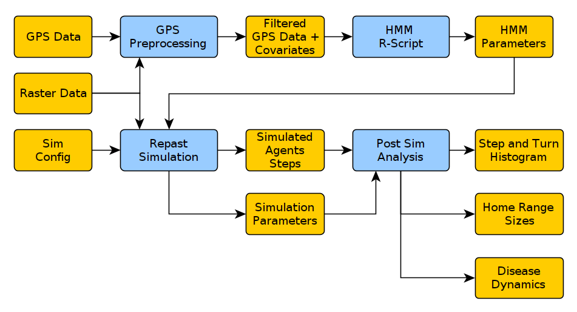

### GPS Data

The GPS data used was for Howard County, contained 54 unique individual ID's, and ranged from 2017-02-01 00:00:10 to 2019-10-02 05:00:30.

 It has approx 250k GPS points that are used to fit a movement model. 

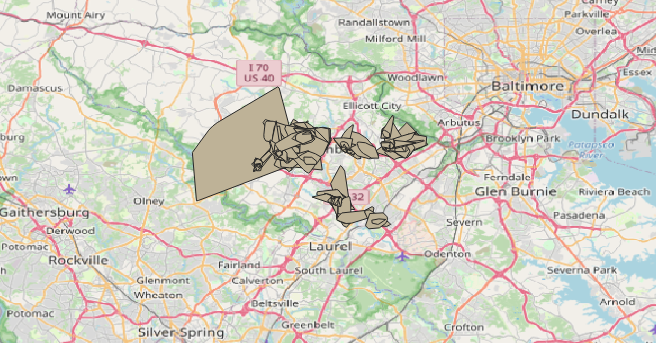.

During this step the average lat/lon per month is calculated to estimate the home range centroid. The distance from the GPS location, and turn angle towards this centroid is also calculated in order to test "return-home" models in the HMM step.

### Raster Data

Landscape data can be nearly any variable that could be used as a "co-variate" when fitting the Hidden Markov Model. In this work a raster file was downloaded from the [MRLC geoserver](https://www.mrlc.gov/geoserver/web/?0). If the raster has no real influence on the HMM it should not really influence the state transition function. So no real harm in trying...

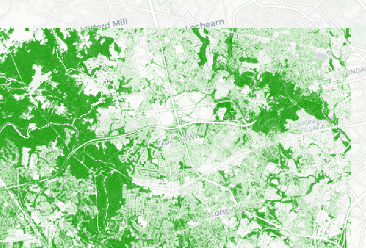

Deer Suitability Maps

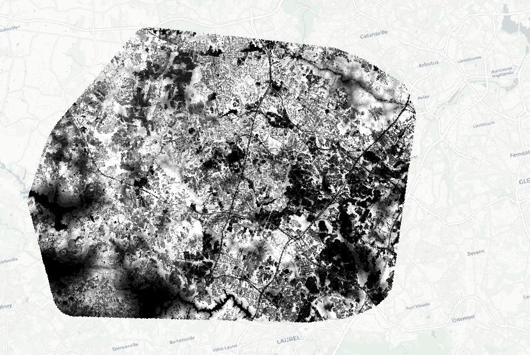

### GPS Data Processing

The movement model is generated from GPS data but the GPS data must first be filtered to remove GPS locations that have poor accuracy (Dilution of Precision values < 10).
Raster data is joined to each GPS point in the [GPS PreProcessing Python notebook](https://github.com/GMU-GeoSciences/Repast4pyModels/blob/main/Notebooks/01-GPS%20PreProcessing-checkpoint.ipynb). The GPS location information (stored as Lat/Lon points) is reprojected into EPSG:5070, which has units of meters and results in each pixel being 30 m x 30 m.

This step can be done to create a filtered GPS file for all deer, or a separate file for male and female deer.

### HMM Script

This [R script](https://github.com/GMU-GeoSciences/Repast4pyModels/blob/main/Notebooks/02-HMM%20R-Script.ipynb) using the MoveHMM library to calculate the most likely set of step and turn parameters that, when combined with the landscape covariate, would best fit the markov chain and behaviour states to the GPS data.

When choosing the HMM model to be used you can select the number of states, the covariate loss function (broadly), and can compare modules using Akaike's Information Constant to score the models compared to the GPS data to find the most accurate model.

General results are:

  - 3 hidden states out perform 2 hidden state models 
  - Step-and-turn models out perform "return home" models (those where the step distance and turn angle are in reference to the home range centroid)
  - States can be characterised as "short, back-tracking steps", "long, straight-line steps" and a third that is a combination of the two.
  - Weibull and Cauchy distributions seems to be a good fit to the data

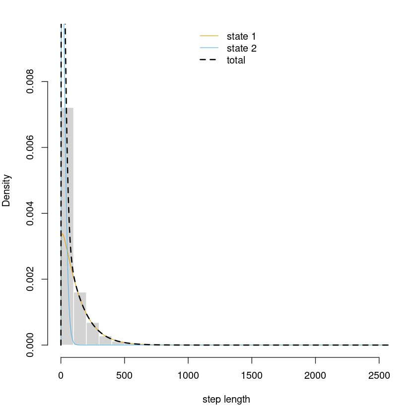

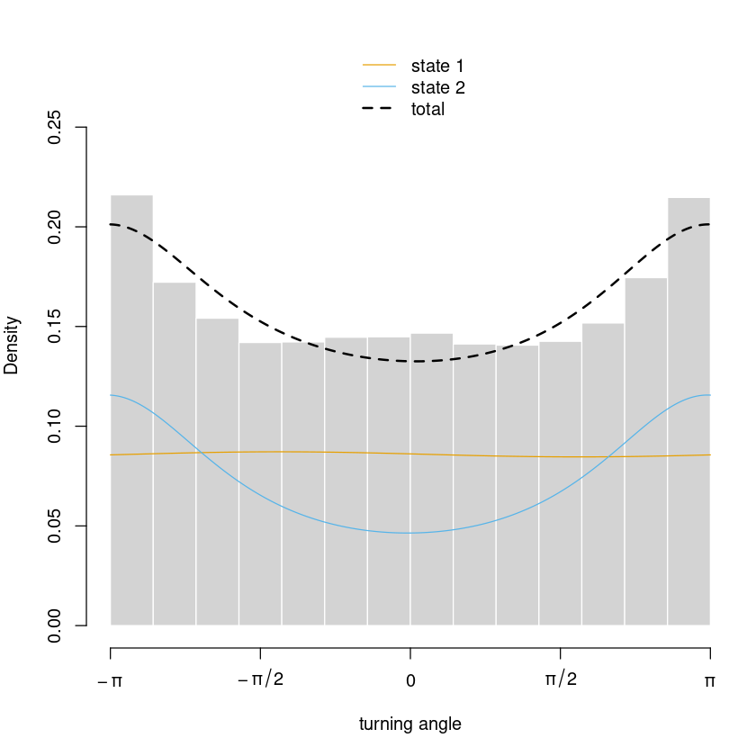

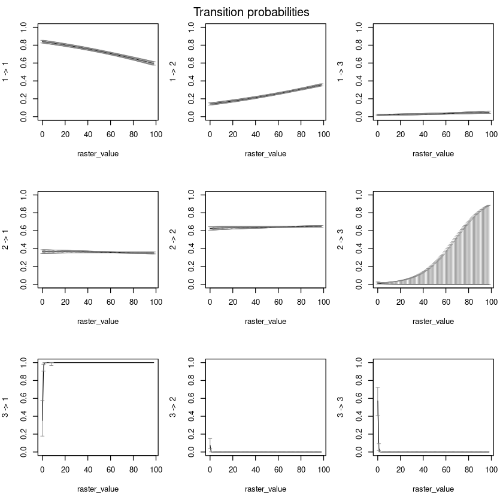

The state transistion matrix and step/turn distribution parameters are hard-coded into a movement model. [Here](https://github.com/GMU-GeoSciences/Repast4pyModels/blob/aeeb369dff8fc36bf83aa7adf06ac86f1abe6a7a/repast4py/deer_agent/movement_hmm.py#L470) is an example of a two state model trained on the canopy raster data:

```python
class HMM_MoveModel_3_States(BaseMoveModel):
    '''
    3 State HMM model. Takes raster data into account. This was trained using the suitability raster and not the canopy raster
    '''
    def __init__(self, *args, **kwargs):
        self.movement_n_states = 3
        self.home_range_limit = 1000 # [meters]?
        self.movement_params = [{'state': 0, 
                                    'state_name': 'HMM State 0',
                                    'step_params':{'c':1.311337,
                                                'loc': 1,
                                                'scale': 3.351919e+02},
                                    'turn_params':{'c': 0.21499672,
                                                'loc': -0.06124627,
                                                'scale': 1}},
                                {'state': 1, 
                                    'state_name': 'HMM State 1',
                                    'step_params':{'c': 1.231843,
                                                'loc': 1,
                                                'scale': 1.132833e+02},
                                    'turn_params':{'c': 0.04074727,
                                                'loc': -3.07373644,
                                                'scale': 1}},
                                {'state': 2, 
                                    'state_name': 'HMM State 2',
                                    'step_params':{'c': 1.470787,
                                                'loc': 1,
                                                'scale': 2.408109e+01},
                                    'turn_params':{'c': 0.2042132,
                                                'loc': 3.1127951,
                                                'scale': 1}}
                                                ] # Params for each different move state. List of N dictionaries of step and turn params
        # HMM Covariate Intercept matrix
        #                                               1 -> 2      1 -> 3      2 -> 1      2 -> 3     3 -> 1    3 -> 2
        self.hmm_covariate_intercept = np.asarray([-1.61019298,-1.62130884,-1.79254789,-1.72515496,-2.2150039,-0.665865790])

        # HMM Covariate Raster Coeff matrix
        self.hmm_covariate_coeff = np.asarray([0.09487647,  0.09543828, -0.08549171,  0.09086488, -0.1138435, 0.006435542])
```

### Sim Config
The simulation configuration is described more [here](https://github.com/GMU-GeoSciences/Repast4pyModels/blob/main/config/README.md). The config is used to determine the simulation parameters, and input/output file names. Each simulation should be very similar when run with the same config file, but there is still some randomness introduced in the choices of agent starting location, step and turn distributions etc. 

### Repast Simulation
More details on the simulation can be found [here](https://github.com/GMU-GeoSciences/Repast4pyModels/blob/main/repast4py/README.md)

### Post Sim Analysis

The post sim analysis notebook is used to confirm that the model is performing as expected, and accurately reflects the GPS input data. Methods of doing this are comparing the GPS histogram of step and turn values, and the same values as extracted from the simulated positions. Another value can be the HomeRange area covered per month (altough a 95% confidence interval of home range points might be better).

In general the tasks used to evaluate a simulation are:

Determine whether the number of points/hours used to calculate the home ranges in the GPS data are similar to the number of points in the simulation. IF you run a simulation that covers a couple of days then the home range should naturally be smaller.

NOTE: These are examples of plots, and not neccesarily the best possible plots to obtain.

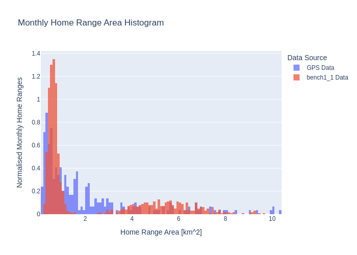 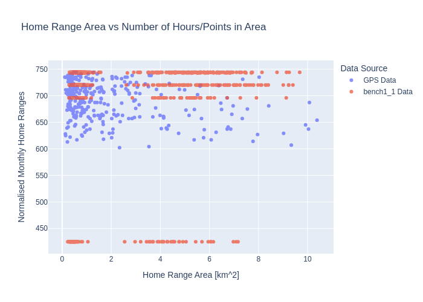

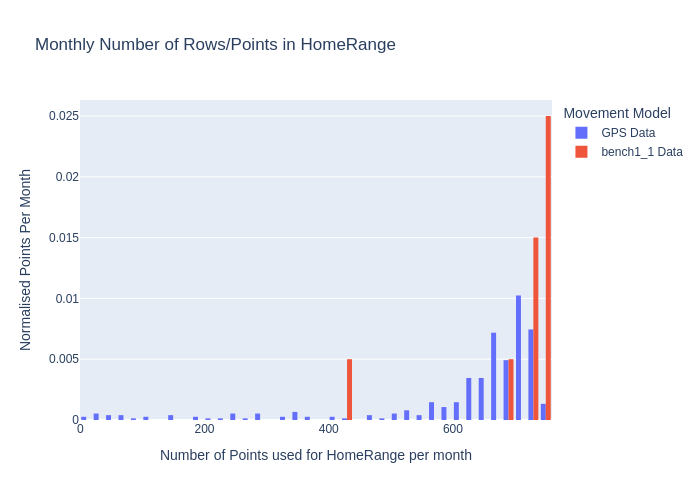

The sim derived step and turn histograms should also be very similar to the GPS data:

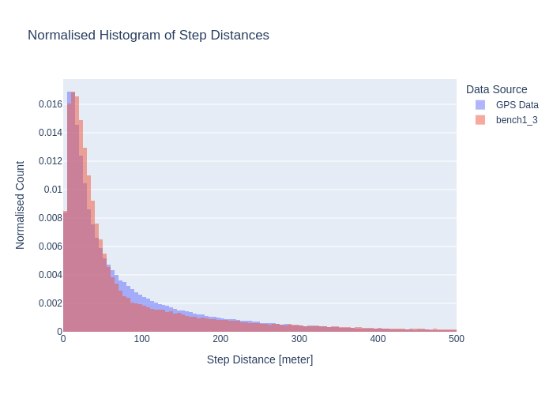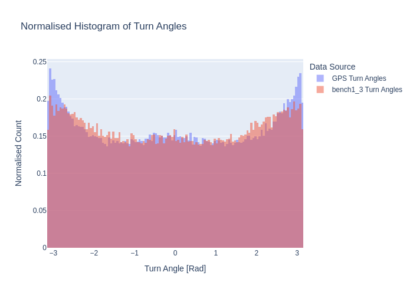

The data is also transformed into geopackages in order to do time-series visualisations in QGIS, for some reason it cannot do these with simple csv files...
  
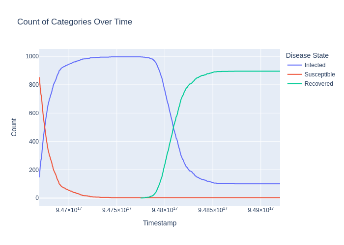
 
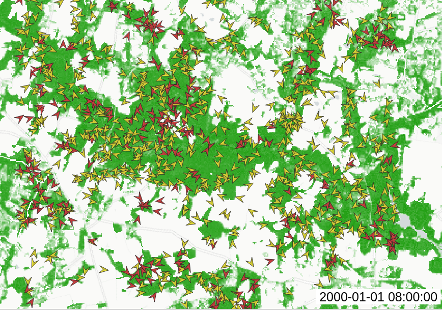

### Batch Simulation

The Repast simulation can be batch run on local machines (given that they can run docker containers) or on GMU's Hopper cluster. The goal of batch simulation would be to determine the differences a single configuration parameter would have on the outcome of the simulation. The batch scripts for the Slurm manager are held in /Repast4pyModels/make-scripts/slurm_scripts/.  

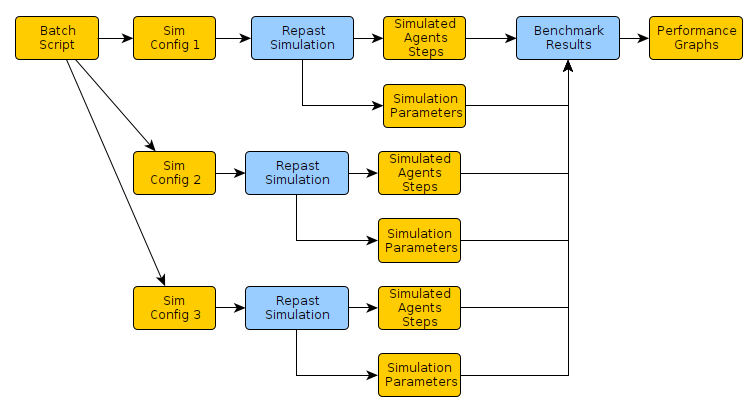

## Notes

 - The turn histograms seem to show a smaller number of turns that are -180 deg/+-pi, it seems the model spends less time backtracking than the GPS data does. 
 - The different turn back limits seem to not make much of a difference to the step and turn histograms, see below.
 - Turn back limits make a large difference to the home range sizes
 - The GPS data is biased towards having more females than males, and this does not seem to be what the end goal is of the simulation. So using GPS as the ground truth isn't going to be 100% accurate.
 - 

Below is a figure of step and turn histograms where the only difference was the "homerange radius" config parameter was 500m for Bench1, 2000m for Bench2 and 10000m for Bench3.
 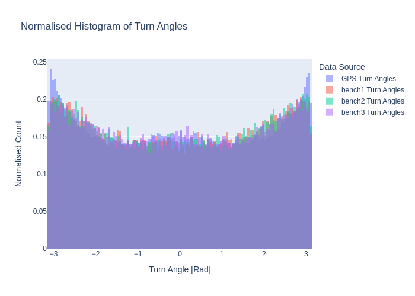

 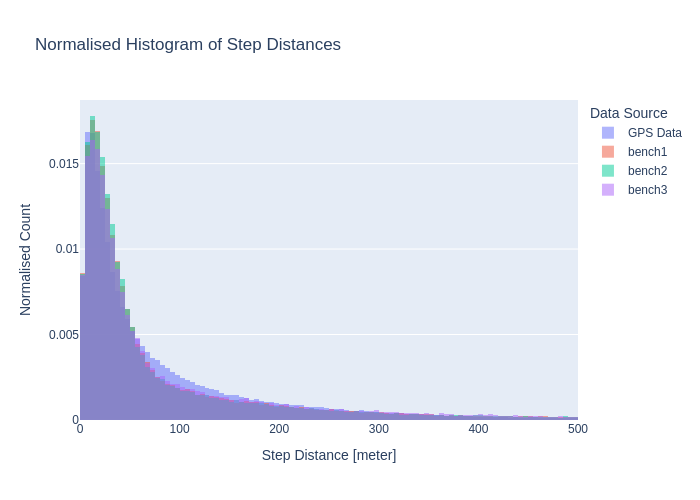

 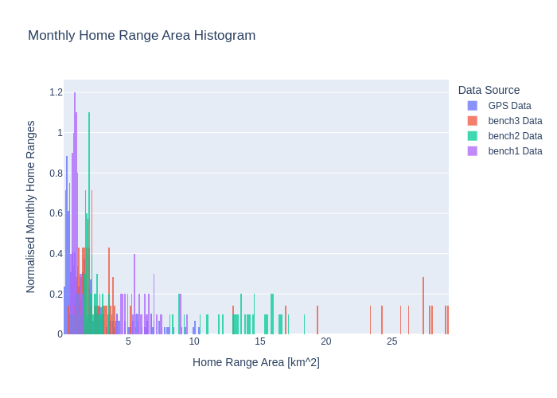
